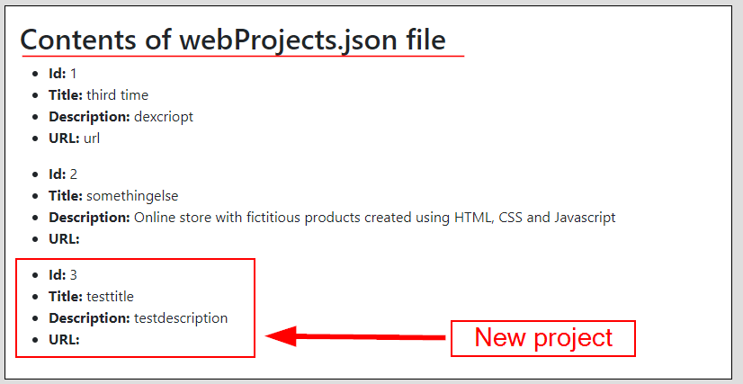

# HyperionDev Full Stack Web Development Bootcamp - Express task - Level 2 - Task 18 - Compulsory task 2 - Express

## Description
This task uses Postman to test an custom API that I have created. You can pass POST, DELETE and PUT requests to the API and it performs various actions, such as adding items to an array, deleting something from an array and updated specific values in an array. See the 3 tasks below for more details.

## Table of Contents
* [Instructions](#instructions)
* [Technologies](#technologies)
* [Installation](#installation)
* [Usage](#usage)
* [Credits](#credits) 

## Instructions
These were the instructions I was given to guide me in this task:

**Follow these steps:**
* Create a Restful API using Express that will allow the user to store a list of ‘Web project’ items.
    * When the user navigates to http://localhost:8080/api an array of ‘Web Project’ items should be returned. E.g. of array:[{"id": 1, "title": "React Game!", "description": "Tic tac toe game created using Create React app.", "URL": "http://heroku/myapp/game/" }, {"id": 2, "title":"Online store", "description": "Online store created with HTML, CSS and JavaScript.", "URL": "https://git.com/myrepos/shop/index"}]
    * The user should be able to use Postman to make an HTTP Post request that adds an additional item to the list of Web Project items.. 
    * The user should be able to use Postman to make an HTTP Delete request that deletes an item with a specific id from the list of Web Project items.
    * The user should be able to make an HTTP Put request to update the title or description of an item on the list of Web Project items using Postman.
* Create a file called readme.md in the project folder of this application that provides the user instructions for testing this API with Postman.

### Technologies
This project uses:
* Javascript ECMAScript 2021
* Express

## Installation
To run this project, do the following:
1. Copy the directory called 'second-express-app' to your local machine.
2. Navigate to this directory from the command line interface. E.g. cd c:/second-express-app.
3. In the command line interface type 'npm install'
4. Once it has finished installing, type 'npm start'. This runs the app in the development mode.
5. Open [http://localhost:8080](http://localhost:8080) to view it in the browser.

## Usage
**Using Postman to test this API**
In order to test this API, first sign up for a free account at [Postman](https://www.postman.com/postman). Postman is a free API development environment. You may also have to install the **Postman Desktop Agent** in order to use this project.

### Task 1
This task shows you how to use "Postman" to make an HTTP Post request that adds an additional item to the list of Web Project items that are displayed when you go to this URL: `http://localhost:8080/api`.

**Steps to follow**
1. Once you have logged into your account, click on the "Workspaces" option at the top of the page and then click on "My Workspace". See figure 1 below.


Figure 1

2. Click on the "Create a Request" option under the "Get Started" section on the right side of the page. See figure 2 below.


Figure 2

3. Click on the "GET" option and select "POST" from the dropdown menu that appears. See figure 3 and 4 below.


Figure 3


Figure 4

4. We are now going to use an HTTP POST request to add a new object to the file called "webProject.json". This object will have the following key:value pairs: `id: 3, title: testtitle, description: testdescription, url: testurl`. 

Type the following command into the text box next to POST: 
```
http://localhost:8080/?id=3&title=testtitle&desc=testdescription&url=testurl

```
See figure 5 below.


Figure 5

5. Click on the "SEND" button to send the request to add the new object to the file. See figure 6 below.


Figure 6

6. If you navigate to the `http://localhost:8080/api` URL now, you will see that the last item is new.

### Task 2
This task uses Postman to make an HTTP Delete request that deletes an item with a specific id (in this case, 3) from the list of Web Project items at `http://localhost:8080/api`.

**Steps to follow**
1. Follow steps 1 - 3 from the previous task, but instead of selecting "POST" from the dropdown menu, select "DELETE".
2. Type the following into the request box `http://localhost:8080/?id=3` and click the "SEND" button on the far right. See figure 7 below.


Figure 7

3. When you navigate to `http://localhost:8080/api` now, you will see that the 3rd item has been deleted.

### Task 3
This task uses Postman to make an HTTP PUT request to update the description of a Web Project item with a particular title (the Web Project items are displayed when you go to this URL: `http://localhost:8080/api`).

**Steps to follow**
1.  Follow steps 1 - 3 from the first task, but instead of selecting "POST" from the dropdown menu on the Postman website, select "PUT". See figure 8 below.


Figure 8

2. Type the following into the text box `http://localhost:8080/1/testTitle` and click the "SEND" button on the right. This is requesting to change the title of the 1st item in the Web Project items list to "testTitle". See figure 9 below.


Figure 9

3. Now check the `http://localhost:8080/api` page to see that the change has been made to the items.

## Credits
This project was created by Evan Malherbe as part of a task for HyperioDev Full Stack Development Bootcamp November 2021 [GitHub profile](https://github.com/evanmalherbe) 
