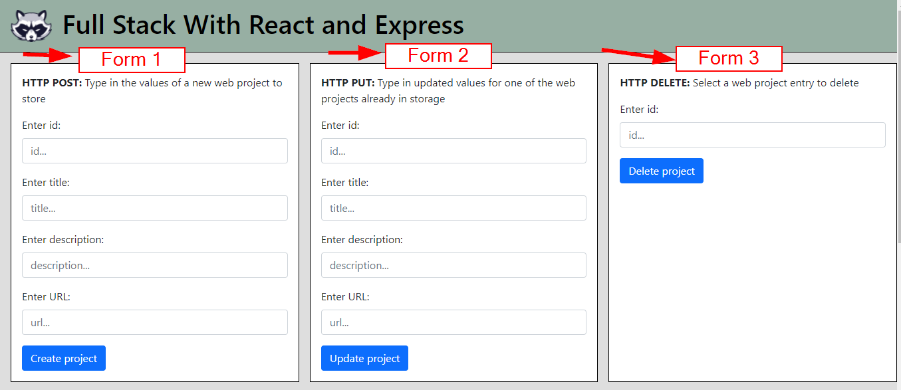

# HyperionDev Full Stack Web Development Bootcamp - Level 2 - Task 19 - Compulsory task 

## Description
This task uses React and Express to create both a frontend and backend server. On the frontend, the contents of a file called "webProjects.json" on the backend server is displayed. There are also 3 forms that allow a user to:
1. Add a new "web project" to the file on the server using an HTTP POST request
2. Update an existing "web project" in the file on the server using an HTTP PUT request
3. Delete an existing "web project" from the file on the server using an HTTP DELETE request

In each case, the updated file contents is displayed at the bottom of the page after changes.

## Table of Contents
* [Instructions](#instructions)
* [Technologies](#technologies)
* [Installation](#installation)
* [Usage](#usage)
* [Credits](#credits) 

## Instructions
These were the instructions I was given to guide me in this task:

**Follow these steps:**
* Create an attractive React frontend that can be used to interact with the API you built with Express in the previous task.
    * You should be able to use your React frontend to get a list of web projects, add additional projects to the list, modify the details about a specific project and delete a project from the list.

### Technologies
This project uses:
* Javascript ECMAScript 2021
* React
* Express
* Node 

## Installation
To run this project, do the following:
1. Copy the directory called 'backend' to your local machine.
2. Navigate to this directory from the command line interface. E.g. cd c:/backend.
3. In the command line interface type 'npm install'.
4. Once it has finished installing, type 'npm start'. 
5. Now navigate to the "/frontend" directory inside "backend". E.g. cd c:/backend/frontend.
6. In the command line interface, once again type 'npm install'.
7. Once it has finished installing, type 'npm start'.
8. You have now started both the backend and frontend servers.
9. Open [http://localhost:3000](http://localhost:3000) to view the project in your web browser.

## Usage
1. Once you open the project in your browser [http://localhost:3000](http://localhost:3000), you will see 3 forms at the top of the page and a list of "Web projects" at the bottom of the page. See figure 1 and 2 below.

Figure 1

Figure 2

### Add New Web Project
2. To create a new web project to add to the file, fill in the first form and click the "Create Project" button at the bottom. See figure 3 below.

Figure 3

3. You will see that your new web project has been added to the list at the bottom of the page. See figure 4 below.

Figure 4

### Update Existing Web Project
4. To update an existing web project in the file, fill in the second form and click the "Update Project" button at the bottom. See figure 5 below.

Figure 5

5. You will see that the web project you updated with new information is displayed at the bottom of the page.

### Delete Existing Web Project
6. To delete an existin web project from the file, fill in the "id" of the project you want to delete in the third form and click the "Delete Project" button. See figure 6 below.

Figure 6

7. You will see that the web project you selected has been deleted/removed from the list at the bottom of the page.

## Credits
This project was created by Evan Malherbe as part of a task for HyperioDev Full Stack Development Bootcamp - November 2021 [GitHub profile](https://github.com/evanmalherbe) 
